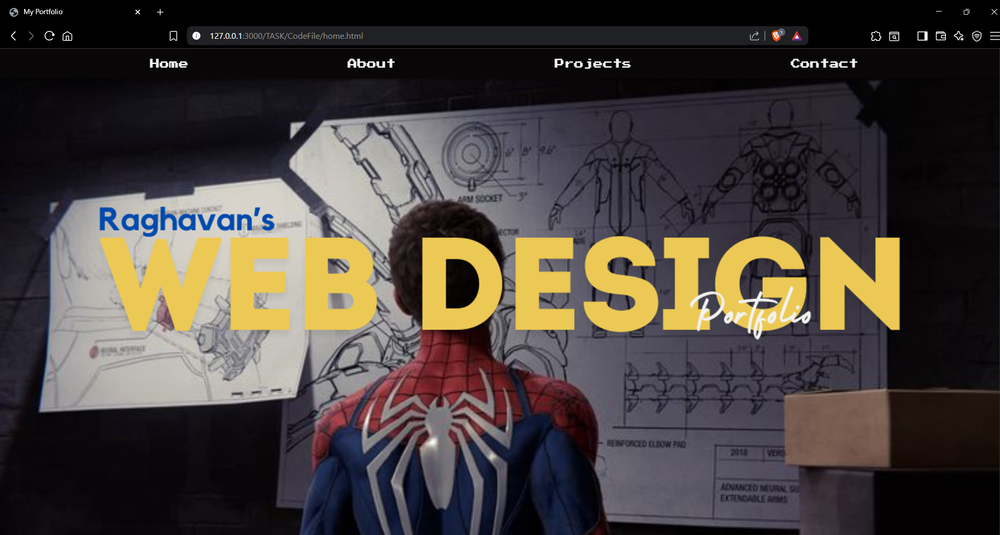
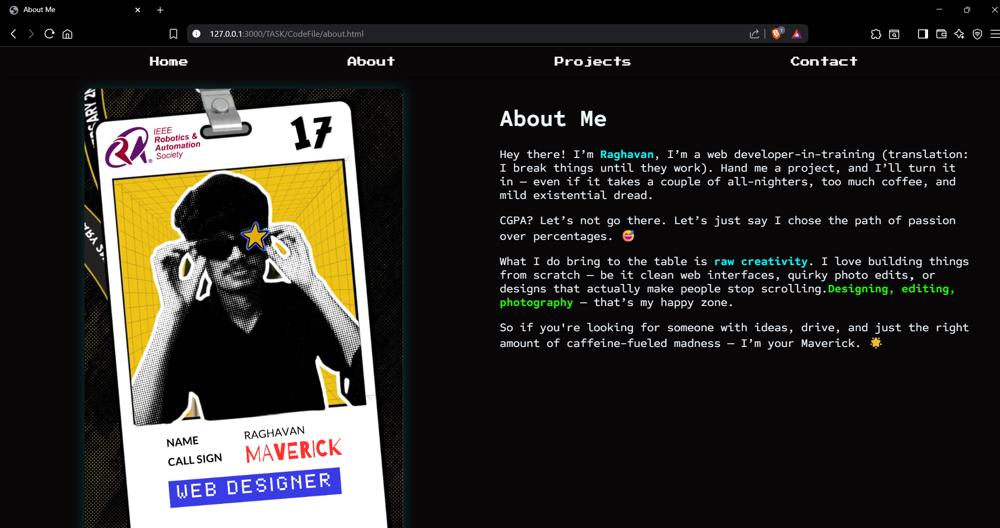
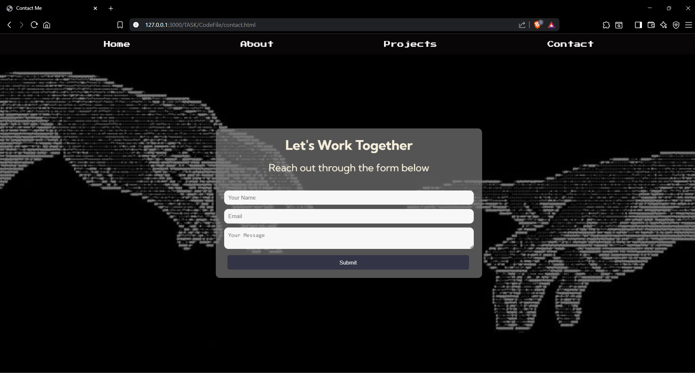

# Portfolio-Website

# 💼 My Portfolio Website

Welcome to my personal portfolio! This is a simple, static website built using HTML and CSS to showcase my projects, contact information, and a brief introduction about myself.

##Overview of the task

This is my first web development project — a fully responsive portfolio website built using HTML, CSS, and basic JavaScript for form validation and interactive elements. I’ve implemented Flexbox and CSS Grid to ensure the layout adapts smoothly across different devices. The typography is powered by Google Fonts, giving the site a modern, clean look, while carefully selected Pinterest-sourced visuals bring personality and style to the design.

The goal was to combine aesthetic appeal with functional simplicity, creating a portfolio that not only represents my skills but also lays the foundation for my journey in web design and development.

## Screenshots

### Home Page

### About Page

### Contact Page

---
## Live link to the website:
https://raghav-portfoliowebsite.netlify.app/

